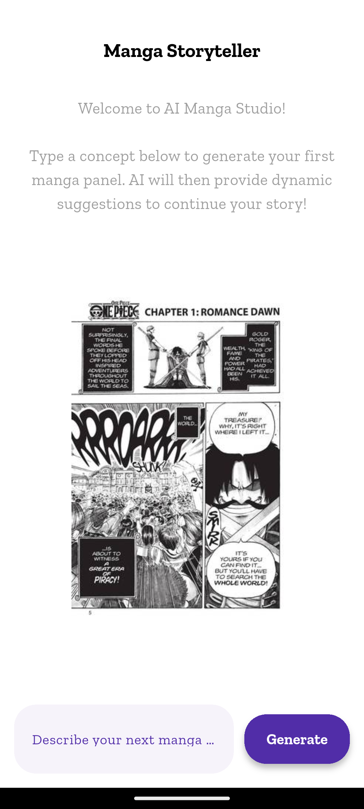
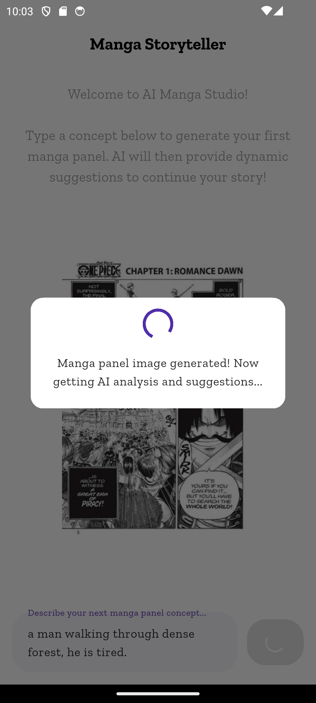
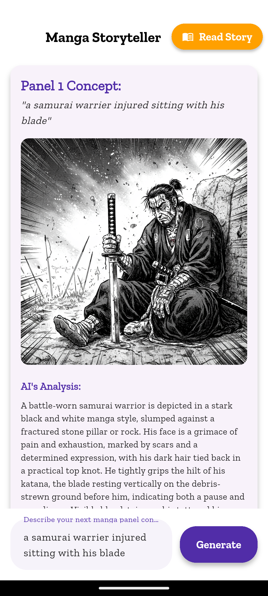
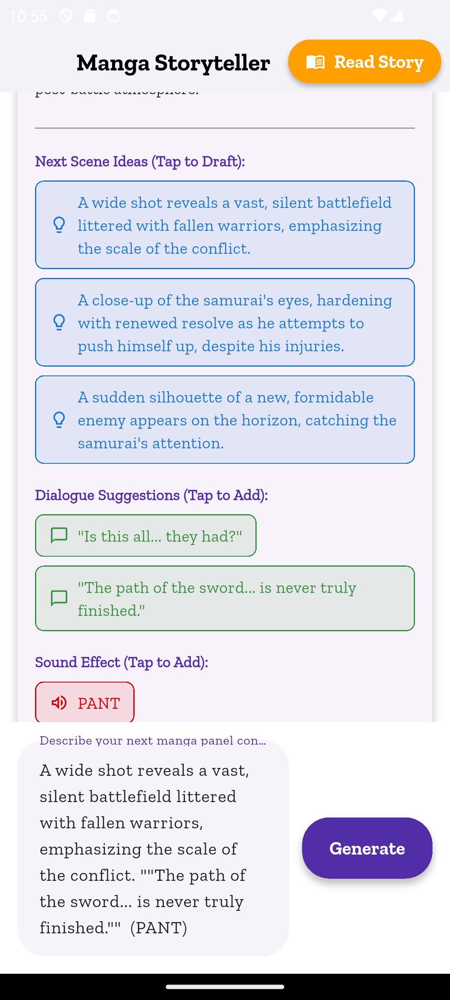
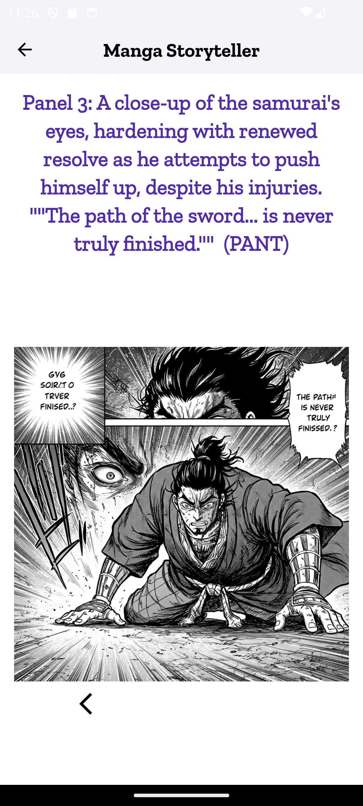

# AI Collaborative Manga Storyteller 📖✨

  
  
  
  
  

## Unveiling Stories, One Panel at a Time

The **AI Collaborative Manga Storyteller** is an innovative Flutter mobile application that transforms narrative creation into an interactive, AI-driven experience. It empowers users to bring their manga concepts to life, evolving from initial ideas into a full-fledged visual story with the seamless integration of Google's advanced generative AI. This project stands as a testament to modern mobile development, intelligent AI integration, and robust architectural design.

## How It Works

This application redefines the creative process for visual storytelling:

1.  **Concept to Panel:** The journey begins with a simple text prompt from the user, describing a desired manga panel (e.g., "A lone samurai stands against a stormy sky.").
2.  **AI Generation:** Leveraging Google Gemini, the application interprets this prompt to perform a multi-faceted generation:
    * **Image Synthesis:** A unique manga panel image is generated to visually represent the prompt.
    * **Contextual Analysis:** The AI provides a detailed textual analysis of the generated panel, breaking down its elements and mood.
    * **Creative Suggestions:** Crucially, the AI then offers dynamic, intelligent suggestions for continuing the narrative. These include:
        * **Next Scene Ideas:** Prompts for what could happen in subsequent panels.
        * **Dialogue Suggestions:** Fitting conversations or monologues for characters.
        * **Sound Effects:** Onomatopoeia to enhance the panel's atmosphere.
3.  **Iterative Storytelling:** Users can tap on these AI suggestions to instantly draft their next panel's prompt, fostering a fluid, collaborative creative loop between human imagination and artificial intelligence.
4.  **Immersive Reading Experience:** Once panels are generated, the entire story can be viewed in a dedicated, fullscreen reader mode, allowing users to scroll through their collaboratively created manga like a digital comic book.

This iterative process empowers creators to overcome writer's block, explore new narrative paths, and witness their visions materialize with AI assistance.

## Key Features

* **Generative AI Core:** Powered by Google Gemini, offering intelligent text-to-image synthesis and contextual text generation.
* **Dynamic Story Progression:** AI-driven suggestions for next scenes, dialogue, and sound effects accelerate the creative flow.
* **Interactive UI:** Seamless input and suggestion integration for an intuitive user experience.
* **Sequential Reading Mode:** A dedicated viewer for enjoying the created manga as a coherent story.
* **Panel Management:** Clear organization and display of individual manga panels with their associated AI insights.
* **Modern Material Design:** A clean, visually appealing interface crafted with Flutter's Material 3 guidelines.

## Technologies & Libraries

This project showcases a blend of cutting-edge technologies for a scalable and performant mobile application:

* **Flutter (Dart):** The primary framework for cross-platform mobile development, enabling a single codebase for Android and iOS.
* **Google Gemini API (via Firebase AI SDK):** The backbone for all generative AI functionalities, from image generation to creative text suggestions.
* **`flutter_bloc` (Cubit):** Employed for robust and predictable state management, ensuring a clear separation of UI from business logic.
* **Firebase Core:** Facilitates seamless integration with Google's Firebase platform for project setup and API access.
* **`equatable`:** Used within BLoC states for simplified value comparison, reducing boilerplate.

## Architecture Highlights

The application is structured with a strong emphasis on clean architecture principles, promoting maintainability, testability, and scalability:

* **Modular Design:** The codebase is organized into logical feature modules (e.g., `manga_creator`), each self-contained.
* **Separation of Concerns:**
    * **`data/`**: Handles interactions with external data sources, abstracting API calls (e.g., `AiService` for Gemini API).
    * **`presentation/bloc/`**: Contains the BLoC (Cubit) logic, managing the application's state and reacting to user input. It acts as the bridge between the UI and data layers.
    * **`presentation/widgets/`**: Houses reusable, "dumb" UI components that primarily receive data and emit events (e.g., `SuggestionTile`, `EmptyStateView`, `CreationListView`, `MangaReaderView`).
    * **`presentation/manga_creator_screen.dart`**: The main screen widget; it's deliberately kept lean, primarily observing BLoC states and delegating rendering to its child widgets.
* **`core/`**: A shared layer for fundamental models (`MangaPanel`), constants, and utility functions (`DialogUtils`) used across different features.

This structured approach ensures the application remains robust and easy to extend as new features are introduced.

## License

This project is licensed under the MIT License - see the [LICENSE](LICENSE) file for details.